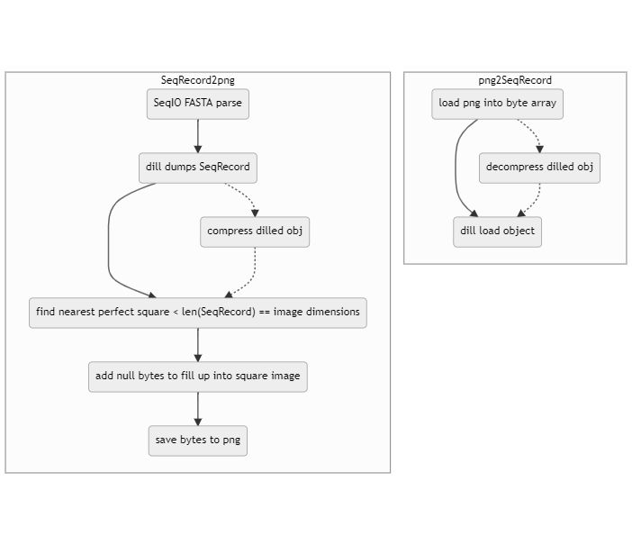



# fasta2png
> Kacper Dudczak, Aleksander Luboński, Maciej Michalczyk

## W skrócie
 - prosty sposób na bezstratne przekształcenie obiektu SeqRecord biopythona do postaci pliku png (w zasadzie każdy arbitralny obiekt da się przekształcić)
 - powstały plik png jest otwieralny w każdym edytorze do plików graficznych
 - prosty sposób odczytu pliku png do obiektu w kodzie (one-liner)

## Opis działania

 - powyższy schemat skupia się na obsłudze sekwencji, ale pierwszy krok z podschematu *SeqRecord2png* można pominąć i zastąpić obsługą jakiegokolwiek obiektu
 - wykropkowany przebieg na schematach przedstawia kroki w dodatkową kompresją:
	 * w normalnym podejściu kompresja leży całkowicie na etapie zapisu do pliku png
	 * z dodatkową kompresją, kompresowany jest zserializowany obiekt, co okazało się skutecznym sposobem dodatkowego zmniejszenia wielkości pliku (zazwyczaj kosztem szybkości działania)
	 * dostępne (do tej pory testowane i zaimplementowane) algorytmy dodatkowej kompresji:
		 + ppm
		 + lz4
		 + bz2
		 + zstandard
 - aby png był poprawnie odczytywany i traktowany jako obraz po kompresji, trzeba wyliczyć wymiary takiego obrazu - znajdowany jest najbliższy idealny pierwiastek wielkości ciągu bajtów, który chcemy przekształcić  w obraz, dzięki czemu uzyskiwane sa wymiary n x n.
	 * często się zdarza, że brakuje pewnej ilości bajtów, aby była wystarczająca ilość danych na taki kwadrat, więc uzupełnia się dane pustymi bajtami, aby dopełnić brakującą część - ma to niewielki wpływ na wielkość pliku
	 * aby nie dopełniać danych pustymi bajtami, obraz musiałby być prostokątem, ale to wymagałoby znalezienia "środkowych" dzielników długości ciągu bajtów, co jest mniej wydajne w pythonie niż najbliższy idealny pierwiastek (przynajmniej metody, które wykorzystywaliśmy do tego były wolniejsze, ale może jest na to jakiś sposób)
 - plik png jest zapisywany w domyślnej kompresji, z głebią 8 bitową

## Benchmark

 - porównanie (skromne) było przprowadzone tylko na sekwencjach nukleotydowych w formacie FASTA
 - była również próba porównania tej metody względem wczytywania surowej fasty, pickle obiektu (binarka), skompresowanej fasty do .gz (tak jak ściągniety plik z NCBI) oraz skompresowanego pickla do .gz - png z każdym z nich wygrało lub ewentualnie było na równi (jedynie pickle potrafił doścignąć). Niestety, nie został ten test zapisany.
 - zstandard był uruchamiany z następującymi ustawieniami: level = 11, threads=-1
 - poniższe testy były wykonane na komputerze z i7-11700K, 32 GB ram oraz WD Blue SN550 1 TB M.2 PCIe NVMe 3.0

### Zapis
|    | type     | file name                  |   original file size (MB) |   new file size (MB) |   exec time (s) |  
|---:|:---------|:---------------------------|--------------------------:|---------------------:|----------------:|  
|  0 | standard | NC_017186.fna              |                   9.90208 |              2.70461 |        1.55734  |  
|  1 | ppm      | NC_017186.fna              |                   9.90208 |              2.18798 |        1.09161  |  
|  2 | lz4      | NC_017186.fna              |                   9.90208 |              3.61305 |        0.494656 |  
|  3 | bz2      | NC_017186.fna              |                   9.90208 |              2.46714 |        0.678548 |  
|  4 | zstd     | NC_017186.fna              |                   9.90208 |              2.61913 |        1.08084  |  
|  5 | standard | caenorhabditis_elegans.fna |                  96.8361  |             29.5382  |       13.8723   |  
|  6 | ppm      | caenorhabditis_elegans.fna |                  96.8361  |             23.574   |       10.9034   |  
|  7 | lz4      | caenorhabditis_elegans.fna |                  96.8361  |             38.4445  |        4.0271   |  
|  8 | bz2      | caenorhabditis_elegans.fna |                  96.8361  |             26.3349  |        6.25205  |  
|  9 | zstd     | caenorhabditis_elegans.fna |                  96.8361  |             28.2227  |        2.78426  |
### Odczyt
|    | type     | file name                                 |   file size (MB) |   exec time (s) |  
|---:|:---------|:------------------------------------------|-----------------:|----------------:|  
|  0 | bz2      | bench\caenorhabditis_elegans_bz2.png      |         26.3349  |       2.7908    |  
|  1 | lz4      | bench\caenorhabditis_elegans_lz4.png      |         38.4445  |       0.386278  |  
|  2 | ppm      | bench\caenorhabditis_elegans_ppm.png      |         23.574   |       3.57138   |  
|  3 | standard | bench\caenorhabditis_elegans_standard.png |         29.5382  |       0.340723  |  
|  4 | zstd     | bench\caenorhabditis_elegans_zstd.png     |         28.2227  |       0.206723  |  
|  5 | bz2      | bench\NC_017186_bz2.png                   |          2.46714 |       0.290505  |  
|  6 | lz4      | bench\NC_017186_lz4.png                   |          3.61305 |       0.0407304 |  
|  7 | ppm      | bench\NC_017186_ppm.png                   |          2.18798 |       0.303751  |  
|  8 | standard | bench\NC_017186_standard.png              |          2.70461 |       0.0344474 |  
|  9 | zstd     | bench\NC_017186_zstd.png                  |          2.61913 |       0.0165492 |

## Repozytorium

Kod jest publicznie dostępny:
https://github.com/phenolophthaleinum/fasta2png.
(przepraszamy za nieporządek ;) )
